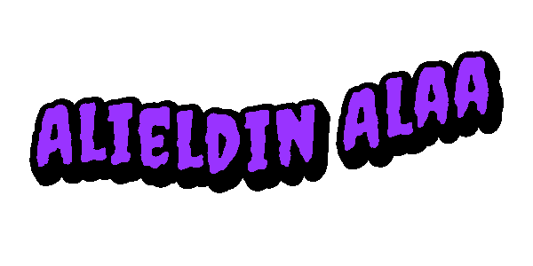

  

# Hi 👋 I'm Alieldin

🎓 Computer Engineering Student @ Cairo University (CGPA: 90% — Excellence)  
🤖 Focused on **Machine Learning**, **Deep Learning**, **NLP**, and **GenAI**
⚙️ Strong Software Engineering foundation in Full-Stack Development & MLOps

---

## 🏆 Highlights

- 🥇 **1st Place — College Research Day**  
  → [Anomaly Detection in Network Traffic](https://github.com/AliAlaa88/Anomaly-Detection-in-Networks) — 99.98% accuracy on KDD Cup 1999 (Random Forest, Isolation Forest, ANOVA)

- 🏅 **Top 6 — Capgemini AI Hackathon**  
  → Built [Young Pharoahs](https://github.com/MoBahgat010/Young-Pharoahs): AR + GenAI assistant with RAG pipeline (Gemini Vision, BGE-M3, Pinecone, STT/TTS)

- 🌍 **LFX Mentorship (RISC-V)**  
  → Automated code generation pipelines from architecture specs

---

## 🔬 ML & AI Projects

| Project | Stack | Highlights |
|---------|-------|------------|
| [Fault Recognition](https://github.com/anas-ibrahem/ml) | Keras, GMM, Librosa, Docker | Audio anomaly detection, VGG-style CNN, Focal Loss |
| [HR Agent](https://github.com/AliAlaa88/HR_Agent) | FastAPI, React, ChromaDB, DistilBERT | Vector job-matching, sentiment analysis |
| [Offside Detection](https://github.com/AbdallahAyman03/Hansi-Flick-Offside-Detection) | OpenCV, RANSAC, K-Means, YOLOv8, Streamlit | ~290ms processing, Classical CV vs. DL benchmark |
| [NumPyNet](https://github.com/AliAlaa88/numpynet) | Pure NumPy, OOP | Neural network from scratch, 4.5x vectorization speedup |
| [SIC Capstone](https://github.com/AliAlaa88/SIC) | Scikit-learn, Pandas, Power BI | Churn prediction, EDA, clustering, dashboards |

---

## 🛠️ Technical Skills

**ML & Deep Learning:** Scikit-learn, NumPy, Pandas, TensorFlow/Keras, PyTorch, XGBoost, Random Forest, K-Means, PCA, GMM, DBSCAN  
**NLP & CV & Audio:** RAG, ChromaDB, Pinecone, Gemini API, OpenCV, YOLOv5/v8, Librosa, Mel-spectrograms, Noise Reduction, Streamlit  
**Data Science:** Matplotlib, Seaborn, Power BI, EDA, Feature Engineering, Statistical Analysis, t-SNE  
**AI Engineering:** FastAPI, Docker, Git/GitHub, CI/CD, Python, SQL, Jupyter Notebooks  
**Software:** TypeScript, JavaScript, C/C++, React.js, Vue.js, Node.js, PostgreSQL, MongoDB, Systems Programming

---

## 🌱 Currently

- Diving deeper into **Generative AI & LLM systems**
- Building **real-world ML/AI pipelines** with production-grade deployment
- Preparing for **AI/ML Engineer roles & research opportunities**

---

## 📫 Connect

